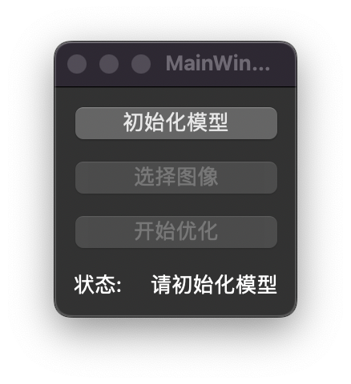

# macOS图像超分

# 功能
- ✅ 利用macOS的Metal框架加速推理
- ✅ 写了简单的UI方便使用
- ☑️️ 支持多种模型
- ☑️️ 支持输入视频


# 环境配置
1. 使用conda创建新的虚拟环境
```
conda create -n imgsr python=3.10
```
2. 安装外部库
```
conda activate imgsr
pip install -r requirements.txt
```

# 运行
### 1.运行py文件
```
python app2.py
```

### 2.打包成app
```
python build.py
# 打包后在build文件夹中找到app2.bin文件
# 将后缀.bin修改为.app即可运行
# app可以移入到应用程序文件夹作为正常程序使用
```


